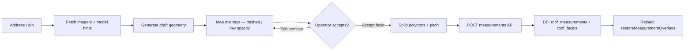

# Roof measure industry patterns (research for ARX in-house tool)

**Scope:** Real products and documented APIs for satellite / hybrid roof measurement — not fiction.  
**ARX codebase:** `/tools/roof-measure` (`app/tools/roof-measure/page.tsx`), `app/api/ai/detect-roof/route.ts`, `app/api/measurements/route.ts`.  
**Date:** 2026-05-27 (Worker R1 research).

---

## Executive summary

Industry tools converge on a **draft → human review → persist → redraw** loop, but they differ on **geometry source**:

| Product | Geometry source | Human step | Turnaround |
|---------|-----------------|------------|------------|
| **Google Solar API** | ML roof segments + mask GeoTIFF; `buildingInsights` returns stats + **bounding boxes**, not facet polygons | Developer vectorizes mask / traces imagery | API seconds |
| **Roofr (report)** | Satellite/aerial imagery + internal trace + **multi-check human QA** | Optional edit after delivery | 2–24 h ([Roofr blog](https://roofr.com/blog/satellite-roof-measurements-for-roofing-businesses)) |
| **Roofr (DIY)** | User draws edges on imagery with grid snap | Operator draws every edge | Instant ([Roofr DIY help](https://roofrhelp.zendesk.com/hc/en-us/articles/31482569335319-How-to-Create-a-Measurement-Report-DIY)) |
| **Hover** | Smartphone **photogrammetry** → 3D model | On-site photo capture (≥8 photos) | Hours ([Hover exterior scans](https://help.hover.to/en/articles/9185612-exterior-scans)) |
| **EagleView** | Proprietary **ortho + oblique aerial** → AI + photogrammetry → 3D twin | Usually none (report product) | Order-based ([EagleView aerial measurements](https://www.eagleview.com/blog/aerial-roof-measurements/)) |
| **ARX (today)** | Google Solar mask/bbox + optional vision trace | Confirm pitch, review geometry, edit vertices | Seconds (in-app) |

ARX is closest to **Google Solar + DIY overlay** (Roofr DIY / MapMeasure-style), not to Hover/EagleView 3D pipelines.

---

## 1. Common architecture patterns

### 1.1 Detect → draft → accept → persist → redraw on load

**Pattern (observed across vendors + ARX):**



| Stage | Industry examples | ARX implementation |
|-------|-------------------|-------------------|
| **Detect** | Roofr: pull imagery by address ([Roofr blog](https://roofr.com/blog/satellite-roof-measurements-for-roofing-businesses)). Google: `buildingInsights:findClosest` + optional `dataLayers` GeoTIFF ([Solar overview](https://developers.google.com/maps/documentation/solar/overview)). EagleView: order against imagery vault ([EagleView developer overview](https://www.eagleview.com/blog/developer-overview-the-geospatial-building-blocks-of-eagleviews-imagery-platform/)). | `detectRoofWithAI()` → `POST /api/ai/detect-roof` with `detectionMode: 'solar'` (default) or `'vision'`. |
| **Draft** | Roofr DIY: outline on imagery before report finalize ([DIY help](https://roofrhelp.zendesk.com/hc/en-us/articles/31482569335319-How-to-Create-a-Measurement-Report-DIY)). | `aiDraftSections` with `status: 'pending'`; dashed blue overlays in `useEffect` on `[aiDraftSections]` (`page.tsx` ~1352–1407). Auto-load path calls `detectRoofWithAI(true, 'solar')` which **auto-accepts** drafts (~1320–1326). |
| **Accept** | Roofr reports editable after delivery ([Contractor ToolStack Roofr review](https://contractortoolstack.com/software/roofr/) — cites Roofr FAQ). Hover: reference measurement note optional ([Hover scans](https://help.hover.to/en/articles/9185612-exterior-scans)). | `acceptDraftItem()` → `polygonsRef`, sets `geometry_reviewed: false`, applies Solar pitch suggestion when allowed (~1446–1530). |
| **Persist** | External CRMs store PDF/ESX; EagleView/Xactimate integrations ([EagleView geospatial software blog](https://www.eagleview.com/eagleview/geospatial-intelligence-software/)). | `POST /api/measurements` requires **manual pitch** + `geometry_reviewed: true`; blocks `solar_bbox` / `solar_mask_whole` (~72–108). |
| **Redraw on load** | Standard in any map-based tool. | `restoreMeasurementOverlays()` rebuilds `google.maps.Polygon` from saved `facet.points` (~589–617). |

**Inferred from docs:** Roofr **paid reports** insert a **human QA queue** between detect and delivery; ARX replaces that with **in-app geometry review + pitch confirmation** gates.

---

### 1.2 Google Solar API — what devs actually get vs. what they draw

#### `buildingInsights` (segment metadata, not polygons)

Documented fields per `roofSegmentStats[]` ([Building Insights](https://developers.google.com/maps/documentation/solar/building-insights), [REST RoofSegmentSizeAndSunshineStats](https://developers.google.com/maps/documentation/solar/reference/rest/v1/buildingInsights/findClosest#RoofSegmentSizeAndSunshineStats)):

- `pitchDegrees`, `azimuthDegrees`
- `stats.areaMeters2` (sloped), `stats.groundAreaMeters2` (footprint)
- `center`, `boundingBox` (sw/ne LatLng)
- `planeHeightAtCenterMeters`
- Panel placement uses `segmentIndex` on each `solarPanels[]` entry — filter panels by segment orientation ([Building Insights — select roof segments](https://developers.google.com/maps/documentation/solar/building-insights))

**There is no documented GeoJSON polygon per segment in `buildingInsights`.** Developers map segments to map geometry by:

1. **Bounding-box quads** — convert `boundingBox` corners to a rectangle (ARX: `buildSolarPlaneFacetPayloads()` in `detect-roof/route.ts` ~299–340). *Inferred:* fast but poor for hips/valleys; ARX labels `facet_source: 'solar_bbox'`.
2. **Mask vectorization** — fetch `dataLayers.maskUrl` (1-bit rooftop mask, 0.1 m/px) ([GeoTIFF docs](https://developers.google.com/maps/documentation/solar/geotiff), [dataLayers REST](https://developers.google.com/maps/documentation/solar/reference/rest/v1/dataLayers)); contour + label pixels by nearest segment center/bbox (ARX: `lib/solar-roof-mask-facets.ts`). *Inferred from ARX code + Google mask spec.*
3. **Vision trace on RGB** — use `dataLayers.rgbUrl` or Static Maps; ML traces edges (ARX vision mode; Google’s internal pipeline described in [Satellite Sunroof paper](https://arxiv.org/html/2408.14400) — U-Net DSM + affinity masks, graph-cut segments, tile stitching).

Google’s published ML pipeline ([Satellite Sunroof](https://arxiv.org/html/2408.14400)):

- Regresses **DSM** + **roof-segment affinity** from satellite RGB
- Builds segment labels via **graph cut on DSM** within building instances
- Stitches tiled inference with weighted kernels
- **`buildingInsights` consumer API exposes aggregated stats**, not raw segment rasters

#### `dataLayers` (rasters for custom vectorization)

Returns URLs for DSM, RGB, **building mask**, flux layers ([data layers request](https://developers.google.com/maps/documentation/solar/data-layers)). Mask = “one bit per pixel… part of a rooftop” ([GeoTIFF table](https://developers.google.com/maps/documentation/solar/geotiff)). URLs expire (~1 hour); cached searches up to 30 days ([GeoTIFF docs](https://developers.google.com/maps/documentation/solar/geotiff)).

**ARX default path:** `tryFacetPayloadsFromSolarRoofMask()` → `facet_source: 'solar_mask_plane'`; fallback empty mask → bbox message with **empty facets** (~1263–1289 in `route.ts`).

---

### 1.3 Hybrid / in-house products (high level only)

#### Roofr

- **Ordered report:** Address → imagery (Google Earth + third parties per [Roofr blog](https://roofr.com/blog/satellite-roof-measurements-for-roofing-businesses)) → internal measurement → **human multi-check** → PDF/diagram with pitch, squares, ridge/hip/valley LF, waste ([measurements product](https://roofr.com/measurements)).
- **DIY:** Operator selects imagery, uses **90° grid**, draws edges, assigns pitch per facet, classifies edge types ([DIY help](https://roofrhelp.zendesk.com/hc/en-us/articles/31482569335319-How-to-Create-a-Measurement-Report-DIY)).
- **Not public:** Trace ML models, API for segments, pricing logic. No API keys assumed here.

#### Hover

- **Capture:** ≥8 exterior photos (sides + corners) via mobile app ([exterior scans](https://help.hover.to/en/articles/9185612-exterior-scans)).
- **Process:** Photogrammetry → 3D model + measurement PDF; optional reference measurement note ([multi-family scan help](https://help.hover.to/en/articles/13168718-how-do-i-scan-the-exterior-of-a-multi-family-residential-property)).
- **Output:** Interactive 3D + PDF (roof-only or full exterior) ([measurement PDF help](https://help.hover.to/en/articles/1215021-understanding-hover-s-measurement-pdf)).
- **Architecture:** 3D-first; **not** satellite auto-outline at address entry.

#### EagleView

- **Capture:** Manned aircraft / drones; **orthogonal + oblique** at sub-inch GSD in premium products ([aerial measurements blog](https://www.eagleview.com/blog/aerial-roof-measurements/), [Reveal / Vault](https://www.eagleview.com/blog/developer-overview-the-geospatial-building-blocks-of-eagleviews-imagery-platform/)).
- **Process:** Photogrammetry + custom AI → 3D property twin, facet-level pitch/area, penetrations ([geospatial intelligence blog](https://www.eagleview.com/eagleview/geospatial-intelligence-software/)).
- **Delivery:** Reports, EagleView One viewer, Imagery API for developers ([developer overview](https://www.eagleview.com/blog/developer-overview-the-geospatial-building-blocks-of-eagleviews-imagery-platform/)).
- **Not public:** Full edge-detection stack; treat as **vendor lock-in imagery + 3D** benchmark.

---

### 1.4 Open-source / engineering blogs — map overlays & polygon timing

| Topic | Finding | Source |
|-------|---------|--------|
| When to attach overlays | Prefer `map` **`idle`** (fires after pan/zoom/tiles settle) over `bounds_changed` | [Stack Overflow — heatmap polygons + idle](https://stackoverflow.com/questions/45160365/google-maps-render-unique-polygons-based-on-id) |
| `idle` binding | Listener must attach **after** map init | [Stack Overflow — idle not firing](https://stackoverflow.com/questions/31700017/google-maps-idle-event-not-firing) |
| Polygon draw async | Adding many polygons returns before browser paint; `idle` may not fire if map didn’t move — may need micro-recenter or `OverlayView.draw` | [Stack Overflow — polygon complete timing](https://stackoverflow.com/questions/9850444/handle-when-drawing-of-polygons-is-complete-in-google-maps-api-v3) |
| Custom raster layers | `ImageMapType` **`tilesloaded`** or custom pending-tile counter | [Stack Overflow — ImageMapType tiles](https://stackoverflow.com/questions/7341769/google-maps-v3-how-to-tell-when-an-imagemaptype-overlays-tiles-are-finished-lo), [Maps JS ImageMapType.tilesloaded](https://developers.google.com/maps/documentation/javascript/reference/image-overlay#ImageMapType.tilesloaded) |
| Multi-layer maps | Reload data on `idle`; `OverlayView` for image overlays synced to projection | [Reintech — multi-layered Maps blog](https://reintech.io/blog/creating-multi-layered-map-google-maps-api) |

**ARX already uses:** `waitForMapToSettle()` → `addListenerOnce(map, 'idle')` + 500 ms cap (`page.tsx` ~1056–1070); called before detect (~1191). Auto-detect on address search uses **550 ms `setTimeout`**, not `idle` (~531–546) — *inferred race risk* (see §2).

---

### 1.5 What contractors expect (forums + aggregated reviews)

Direct **Reddit** threads were **not reliably indexed** in this research pass (search returned no primary threads). Findings below combine **vendor docs**, **third-party contractor reviews**, and **ARX-adjacent industry blogs** — labeled accordingly.

| Expectation | Evidence |
|-------------|----------|
| **Squares + pitch per slope** | Roofr reports: area, pitch, direction, ridge/hip/valley, diagram ([Roofr blog](https://roofr.com/blog/satellite-roof-measurements-for-roofing-businesses), [order help](https://roofrhelp.zendesk.com/hc/en-us/articles/31322662330775-How-to-Order-a-Roofr-Measurement-Report)) |
| **Fast turnaround for satellite** | 2 h on paid Roofr plans; 2–24 h range ([Roofr blog](https://roofr.com/blog/satellite-roof-measurements-for-roofing-businesses)) |
| **Editable / fixable reports** | Roofr FAQ cited: no service 100% accurate; reports editable ([Contractor ToolStack](https://contractortoolstack.com/software/roofr/)) |
| **Verify complex roofs on-site** | Pitch misreads on multi-plane roofs; tree cover / complex geometry issues ([RooferBase Roofr review](https://www.rooferbase.com/blog/roofr-software-what-roofers-need-to-know-in-2025), [Roofr vs Hover comparison](https://roofingsoftwareguide.com/comparisons/roofr-vs-hover/)) |
| **Insurance / Xactimate** | EagleView widely used for claims; Hover Xactimate integration; Roofr ESX export (2026) ([EagleView review](https://roofingsoftwareguide.com/reviews/eagleview-review/), [Contractor ToolStack](https://contractortoolstack.com/software/roofr/)) |
| **Instant satellite for lead widgets** | SkyRoof / RuufPro / RoofMammoth: address → immediate ballpark ([SkyRoof](https://skyroof.io/), [RuufPro](https://www.ruufpro.com/)) — *lower bar than production takeoff* |
| **DIY grid + edge typing** | Roofr DIY: grid snap, color-coded angles, edge type toolbox ([DIY help](https://roofrhelp.zendesk.com/hc/en-us/articles/31482569335319-How-to-Create-a-Measurement-Report-DIY)) |

**Inferred for ARX:** Contractors accept **satellite-first** for standard suburban re-roofs but expect **visible diagram on map**, ability to **fix pitch and outline**, and **ridge/valley LF** for material/waste — matching ARX’s facet panel + `classifyRoofEdges` path ([internal providers doc](./roof-measurement-providers.md)).

---

## 2. Known failure modes

| Failure mode | Mechanism | Industry parallel | ARX touchpoints |
|--------------|-----------|-------------------|-----------------|
| **Overlay / detect race** | Detect reads center/zoom before `fitBounds` / tile load completes; overlays drawn then cleared by effect cleanup | Maps `idle` vs timeout ([SO idle](https://stackoverflow.com/questions/31700017/google-maps-idle-event-not-firing)) | Auto-detect `setTimeout(550)` (~531–546); draft effect cleanup clears overlays on `[aiDraftSections]` change (~1404–1406); `autoAcceptAllDrafts` skips draft UI (~1320–1326) |
| **Bbox-only vs segment polygons** | `buildingInsights.boundingBox` is axis-aligned, not roof outline | Google docs — bbox is location hint, not edge geometry ([REST](https://developers.google.com/maps/documentation/solar/reference/rest/v1/buildingInsights/findClosest#RoofSegmentSizeAndSunshineStats)) | `buildSolarPlaneFacetPayloads`, `facet_source: 'solar_bbox'`; API returns **empty facets** + notes when only bbox (~1266–1288) |
| **Zoom / projection mismatch** | Static Maps / vision bitmap uses **integer zoom**; JS map may be fractional; pixel→lat/lng uses wrong zoom → shifted polygons | *Inferred from Web Mercator static map behavior* | Vision path snaps zoom + `alignWithClientMap` / `geoZoomForPixels` logic (`route.ts` ~1536–1550, `page.tsx` ~1193–1207) |
| **Viewport vs snapshot bounds** | `map.getBounds()` wider than Static Maps snapshot — scaling facets to full bounds stretches geometry | Comment in `route.ts` ~1596–1600 | Vision uses Mercator from snapshot center/zoom, not bounds stretch |
| **Mask without split** | Single connected mask for whole roof — no facet boundaries | Mask is binary rooftop, not per-segment ([GeoTIFF](https://developers.google.com/maps/documentation/solar/geotiff)) | `solar_mask_whole` blocked at save (~101–108); needs manual split |
| **Duplicate / stacked facets** | ML or vision traces same plane twice | *Inferred* | `dedupeAndCapFacetFootprints`, `isStackedBandVisionTrace` (`route.ts`, `lib/roof-vision-quality.ts`) |
| **Solar anchor vs user pin** | `buildingInsights.center` ≠ geocoded address pin | Documented `findClosest` behavior | `filterFacetsToRequestedStructure`, anchor fallback ~70 m (`route.ts`) |
| **Accept silently drops facets** | Invalid coords or area &lt; 10 sq ft | *Inferred* | `acceptDraftItem` ~1469–1471 — metrics in sidebar without polygons |
| **Geometry library missing** | `google.maps.geometry.spherical.computeArea` fails | Maps JS **geometry** library required | `hasRequiredGoogleMapMeasureLibraries` (see [missing polygons prompt](./prompts/roof-measure-missing-google-polygons.md)) |
| **Stale imagery / no coverage** | Solar `imageryQuality`, expanded coverage experimental ([expanded coverage](https://developers.google.com/maps/documentation/solar/expanded-coverage)) | EagleView unusable on new construction without capture ([EagleView review](https://roofingsoftwareguide.com/reviews/eagleview-review/)) | Empty detect response + `skipAutoDetectAfterFailureRef` (~1338–1340) |
| **3D pitch vs 2D footprint** | Satellite infer pitch; user sees wrong slope area | Hover/Roofr pitch from model/imagery | ARX requires **manual pitch** before save (`measurements/route.ts` ~85–90) |

---

## 3. Actionable recommendations for ARX

Priority legend: **P0** = blocks correct outlines or save path; **P1** = quality / contractor trust.

### P0

| # | Recommendation | Rationale | ARX files |
|---|----------------|-----------|-----------|
| **P0-1** | **Unify auto-detect gating on `waitForMapToSettle` (idle), not 550 ms alone** | Industry pattern: read map state after `idle` ([Maps JS](https://developers.google.com/maps/documentation/javascript/reference/map#Map.idle)). ARX detect already waits; auto-detect on address search does not. | `page.tsx` auto-detect effect ~523–549; reuse `waitForMapToSettle` ~1056–1070 |
| **P0-2** | **When API returns zero facets, never show sidebar-only success** — banner + CTA (“Draw a section”, “Reload outline”) | Roofr DIY always shows imagery + grid before measure ([DIY help](https://roofrhelp.zendesk.com/hc/en-us/articles/31482569335319-How-to-Create-a-Measurement-Report-DIY)). Empty map + notes = reported prod bug ([missing polygons prompt](./prompts/roof-measure-missing-google-polygons.md)). | `page.tsx` `detectRoofWithAI` ~1338–1340, notes ~1312–1316; `detect-roof/route.ts` empty responses ~1266–1419 |
| **P0-3** | **Keep blocking `solar_bbox` / `solar_mask_whole` at save; surface in UI before save attempt** | Bbox ≠ quote-ready geometry (Google bbox is not outline). Already enforced server-side. | `app/api/measurements/route.ts` ~101–108; `page.tsx` save guards ~2369–2480 |
| **P0-4** | **Log / UI feedback when `acceptDraftItem` skips facets** (area &lt; 10 sq ft, invalid coords) | Auto-accept path hides draft overlays; silent skips look like “missing polygons”. | `page.tsx` `acceptDraftItem` ~1458–1471; auto-accept ~1320–1326 |
| **P0-5** | **Pass identical `mapBounds`, `mapWidthPx`, `mapHeightPx`, rounded zoom to detect-roof on every call** | Vision path documents bounds/snapshot mismatch failure (`route.ts` ~1596–1600). Solar mask georeferencing depends on consistent lat/lng + zoom. | `page.tsx` ~1219–1257; `detect-roof/route.ts` body ~1148–1183, vision geo ~1536–1550 |
| **P0-6** | **Require explicit “Review outline” (`geometry_reviewed`) in UI for auto-accepted Solar facets** | Replaces Roofr human QA with operator attestation. Server already requires `geometry_reviewed: true`. | `page.tsx` facet cards ~2994+; `measurements/route.ts` ~93–98 |

### P1

| # | Recommendation | Rationale | ARX files |
|---|----------------|-----------|-----------|
| **P1-1** | **Prefer `solar_mask_plane` quality gate; tune `MIN_PLANE_FOOTPRINT_SQFT` vs fallback to bbox** | Google mask is 0.1 m/px; segment split uses `roofSegmentStats` centers/bboxes ([GeoTIFF](https://developers.google.com/maps/documentation/solar/geotiff)). | `lib/solar-roof-mask-facets.ts` ~45–46, `detect-roof/route.ts` ~1221–1260 |
| **P1-2** | **Show `imageryQuality` / facet_source badge in UI** | Google documents `imageryQuality: HIGH \| MEDIUM \| BASE` on insights ([building insights response](https://developers.google.com/maps/documentation/solar/building-insights)). Sets contractor expectations. | `detect-roof/route.ts` fetch ~577–624 (extend response); `page.tsx` notes area |
| **P1-3** | **Optional draft mode: `autoAcceptAllDrafts: false` for first visit** | Roofr DIY keeps dashed outline until operator confirms ([DIY help](https://roofrhelp.zendesk.com/hc/en-us/articles/31482569335319-How-to-Create-a-Measurement-Report-DIY)). | `page.tsx` ~1320–1328, ~545 |
| **P1-4** | **On measurement reload, call `restoreMeasurementOverlays` only after `mapsLoaded` + map idle** | Same race class as detect. | `page.tsx` `restoreMeasurementOverlays` ~589+; load measurement effect |
| **P1-5** | **Vision: always send client-aligned static snapshot (already partial)** | Fractional zoom skew ([page.tsx comment](~1193–1197)). | `fetchVisionAlignedStaticSnapshotBase64`, `clampVisionAlignStaticZoom` |
| **P1-6** | **Document for ops: verify one pitch on-site for complex roofs** | Contractor reviews ([Roofr vs Hover](https://roofingsoftwareguide.com/comparisons/roofr-vs-hover/), [RooferBase](https://www.rooferbase.com/blog/roofr-software-what-roofers-need-to-know-in-2025)). | QA template [roof-measure-qa-TEMPLATE.md](./roof-measure-qa-TEMPLATE.md) |
| **P1-7** | **Dedupe warning when multiple facets share `solar_segment_index`** | Solar segments can merge planes ([Satellite Sunroof](https://arxiv.org/html/2408.14400)). | `page.tsx` `updateMeasurements` (see [providers doc](./roof-measurement-providers.md)) |

---

## 4. What NOT to copy

| Anti-pattern | Why avoid for ARX |
|--------------|-------------------|
| **EagleView / Hover 3D-only pipeline** | Requires proprietary capture or on-site photos ([Hover scans](https://help.hover.to/en/articles/9185612-exterior-scans), [EagleView One](https://www.eagleview.com/eagleview-one/)); conflicts with address-in → outline-out desire path. |
| **Vendor lock-in imagery** | EagleView Vault/Reveal licensing ([developer overview](https://www.eagleview.com/blog/developer-overview-the-geospatial-building-blocks-of-eagleviews-imagery-platform/)); not interchangeable with Google Solar. |
| **Treating `boundingBox` as final facet** | Documented as segment location bounds, not roof edge geometry ([REST](https://developers.google.com/maps/documentation/solar/reference/rest/v1/buildingInsights/findClosest#RoofSegmentSizeAndSunshineStats)). ARX correctly blocks save. |
| **Roofr “2 hour human report” SLA** | Ops model, not API — copying SLA without QA staff misleads users ([Roofr measurements](https://roofr.com/measurements)). |
| **Instant lead-widget accuracy claims** | Products like SkyRoof claim ~98% ([SkyRoof](https://skyroof.io/)) without independent benchmarks — [Roofr vs Hover](https://roofingsoftwareguide.com/comparisons/roofr-vs-hover/) notes **no published third-party accuracy studies**. |
| **Auto pitch save without confirmation** | Contractor distrust on complex roofs ([Contractor ToolStack](https://contractortoolstack.com/software/roofr/)). ARX manual pitch gate is correct. |
| **2D adjacency = Aurora 3D edge LF** | Documented ARX limitation ([roof-measurement-providers.md](./roof-measurement-providers.md)). |
| **LLM vision as default detect** | Cost + placeholder traces; Google mask path is $0 LLM ([detect-roof/route.ts](~1221–1222)). |
| **Assuming Reddit consensus** | Primary Reddit threads not verified in this pass — use paying-customer QA over anecdotal votes. |

---

## 5. Claim index (sources)

### Primary documentation

- Google Solar overview — https://developers.google.com/maps/documentation/solar/overview  
- Building Insights — https://developers.google.com/maps/documentation/solar/building-insights  
- RoofSegmentSizeAndSunshineStats REST — https://developers.google.com/maps/documentation/solar/reference/rest/v1/buildingInsights/findClosest#RoofSegmentSizeAndSunshineStats  
- Data layers — https://developers.google.com/maps/documentation/solar/data-layers  
- GeoTIFF / mask — https://developers.google.com/maps/documentation/solar/geotiff  
- Expanded coverage — https://developers.google.com/maps/documentation/solar/expanded-coverage  
- Maps JS Map.idle — https://developers.google.com/maps/documentation/javascript/reference/map#Map.idle  
- Maps JS ImageMapType.tilesloaded — https://developers.google.com/maps/documentation/javascript/reference/image-overlay#ImageMapType.tilesloaded  

### Vendor product / help

- Roofr satellite blog — https://roofr.com/blog/satellite-roof-measurements-for-roofing-businesses  
- Roofr measurements — https://roofr.com/measurements  
- Roofr DIY — https://roofrhelp.zendesk.com/hc/en-us/articles/31482569335319-How-to-Create-a-Measurement-Report-DIY  
- Hover exterior scans — https://help.hover.to/en/articles/9185612-exterior-scans  
- Hover measurement PDF — https://help.hover.to/en/articles/1215021-understanding-hover-s-measurement-pdf  
- EagleView aerial measurements — https://www.eagleview.com/blog/aerial-roof-measurements/  
- EagleView geospatial software — https://www.eagleview.com/eagleview/geospatial-intelligence-software/  
- EagleView developer / imagery platform — https://www.eagleview.com/blog/developer-overview-the-geospatial-building-blocks-of-eagleviews-imagery-platform/  

### Research / engineering

- Satellite Sunroof (Google Solar ML pipeline) — https://arxiv.org/html/2408.14400  
- Stack Overflow: idle, polygon timing, ImageMapType tiles — links in §1.4  
- Reintech multi-layer Maps — https://reintech.io/blog/creating-multi-layered-map-google-maps-api  

### Contractor market (secondary — not independent benchmarks)

- Contractor ToolStack Roofr review — https://contractortoolstack.com/software/roofr/  
- Roofing Software Guide Roofr vs Hover — https://roofingsoftwareguide.com/comparisons/roofr-vs-hover/  
- Roofing Software Guide EagleView review — https://roofingsoftwareguide.com/reviews/eagleview-review/  
- RooferBase Roofr review — https://www.rooferbase.com/blog/roofr-software-what-roofers-need-to-know-in-2025  

### ARX internal (implementation truth)

- [roof-measurement-providers.md](./roof-measurement-providers.md)  
- [prompts/roof-measure-missing-google-polygons.md](./prompts/roof-measure-missing-google-polygons.md)  
- `app/tools/roof-measure/page.tsx`  
- `app/api/ai/detect-roof/route.ts`  
- `app/api/measurements/route.ts`  
- `lib/solar-roof-mask-facets.ts`  

### Uncertain / not verified

- **Reddit r/Roofing, r/solar threads** — not retrieved; contractor expectations above use vendor + secondary review sources.  
- **Exact Roofr internal ML** — not public; described only as satellite + human QA from marketing/help.  
- **EagleView 98.77% accuracy** — cited on third-party review ([EagleView review](https://roofingsoftwareguide.com/reviews/eagleview-review/)), not verified against primary EagleView docs in this pass.  
- **IH forum posts** — no on-topic threads found in search.

---

## Appendix: ARX detect source precedence (today)

```
detectionMode=solar (default)
  1. solar_mask_plane   ← dataLayers mask + segment labeling (lib/solar-roof-mask-facets.ts)
  2. solar_mask_whole   ← whole-roof mask contour
  3. (empty facets)     ← if only bbox available — user must draw or vision
  4. solar_bbox         ← built internally but not returned as facets when mask fails (empty + note)

detectionMode=vision (flag-gated)
  GPT-4o trace + optional geometry review pass
  Solar hints = pixel regions from bbox, NOT coordinates (route.ts buildSolarFacetDetectionPromptText)
```

*Inferred from* `app/api/ai/detect-roof/route.ts` control flow ~1221–1420, 1422–1764.
