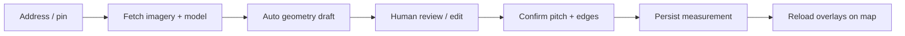

# Roof measurement industry patterns (research)

**Purpose:** Document how real in-house / hybrid satellite roof-measure products work, common failure modes, and actionable recommendations for ARX CRM roof measure.

**Scope:** Public documentation, vendor help centers, Google Solar API docs, academic/industry papers describing Google’s pipeline, contractor-facing reviews. **No invented APIs or features.**

**Related ARX docs:** [roof-measurement-providers.md](./roof-measurement-providers.md), [prompts/roof-measure-missing-google-polygons.md](./prompts/roof-measure-missing-google-polygons.md)

**Research date:** 2026-05-27

---

## 1. Common architecture patterns

Industry products converge on a **detect → draft → accept → persist → redraw on load** loop, even when backend detection differs.

### 1.1 Google Solar API (Building Insights + dataLayers)

Google exposes **two complementary surfaces**:

| Endpoint | What it returns | Polygon detail |
|----------|-----------------|----------------|
| [`buildingInsights:findClosest`](https://developers.google.com/maps/documentation/solar/building-insights) | Per-segment **stats** (pitch, azimuth, sloped/ground area), **center**, **boundingBox**, panel layouts with `segmentIndex` | **No GeoJSON polygon** — only axis-aligned `LatLngBox` per segment ([docs](https://developers.google.com/maps/documentation/solar/building-insights)) |
| [`dataLayers:get`](https://developers.google.com/maps/documentation/solar/data-layers) | URLs to GeoTIFF rasters: DSM, RGB, **mask**, flux, shade ([mask spec](https://developers.google.com/maps/documentation/solar/geotiff)) | **1-bit rooftop mask** at ~0.1 m/px — raster, not pre-segmented vectors ([REST `maskUrl`](https://developers.google.com/maps/documentation/solar/reference/rest/v1/dataLayers)) |

**How developers map segments to polygons (documented + inferred):**

1. **Bounding-box quads (fast, coarse):** Convert each `roofSegmentStats[].boundingBox` SW/NE corners to a lat/lng quadrilateral. Google docs show `center`, `boundingBox`, pitch, azimuth — not vertex rings ([Building Insights reference](https://developers.google.com/maps/documentation/solar/building-insights)). *Inferred from docs:* acceptable for solar panel placement hints, **not** quote-grade roof facets.

2. **Mask vectorization (better footprints):** Fetch `maskUrl` GeoTIFF → contour/polygonize rooftop pixels → optionally **split** using segment centers/bboxes or DSM plane labels. Google does **not** ship segment polygons in the mask file ([GeoTIFF layers](https://developers.google.com/maps/documentation/solar/geotiff)). *Inferred from docs + ARX implementation:* this is what `lib/solar-roof-mask-facets.ts` does (d3-contour + segment labeling).

3. **Vision trace on aligned imagery (hybrid):** Use segment metadata as **hints only** (pitch, azimuth, count); trace visible eaves/ridges in satellite/RGB. Google’s own “Satellite Sunroof” paper describes an internal pipeline: DSM + roof segments from graph-cut on photogrammetry labels, U-Net affinity masks, tile stitching, then ray-tracing for flux ([arXiv:2408.14400](https://arxiv.org/html/2408.14400)) — **not** a public “draw polygon” API.

4. **Panel → segment join:** `solarPanels[].segmentIndex` links proposed panels to `roofSegmentStats` indices ([Building Insights — select roof segments](https://developers.google.com/maps/documentation/solar/building-insights)). Useful for solar apps; roofing apps still need facet polygons separately.

**ARX mapping today:** `app/api/ai/detect-roof/route.ts` tries mask planes first (`tryFacetPayloadsFromSolarRoofMask`), falls back to bbox quads (`buildSolarPlaneFacetPayloads`), optional vision path with Solar hints (`buildSolarPixelPlaneHints`, `buildSolarFacetDetectionPromptText`).

### 1.2 Roofr (hybrid satellite + human QA)

Public positioning ([Roofr measurements](https://roofr.com/measurements), [satellite blog 2026](https://roofr.com/blog/satellite-roof-measurements-for-roofing-businesses)):

- **Ordered reports:** Address → pull satellite/aerial imagery (Google Earth + third parties, per blog) → internal trace + formulas → **human multi-check** → PDF/diagram in **2–24 hours** ([measurements product page](https://roofr.com/measurements)).
- **DIY tool:** Operator selects imagery, zooms, uses **90° grid overlay**, draws edges, assigns edge types and per-facet pitch ([Roofr DIY help](https://roofrhelp.zendesk.com/hc/en-us/articles/31482569335319-How-to-Create-a-Measurement-Report-DIY)).
- **Deliverables contractors expect:** squares, pitch per slope, ridge/hip/valley/eave/rake LF, diagram, waste/material lists ([satellite blog](https://roofr.com/blog/satellite-roof-measurements-for-roofing-businesses)).
- **Accuracy claim:** “within 1–2 inches” on standard residential roofs ([Roofr measurement guide](https://roofr.com/blog/roof-measurements)) — **vendor marketing**, not independent benchmark.

*Inferred from docs:* Roofr’s default path is **not** “instant auto-polygons on map”; speed comes from outsourced/human-assisted trace. DIY is explicitly manual accept/edit.

### 1.3 Hover (capture-first 3D, not satellite-first)

Hover is **photogrammetry from smartphone photos**, not satellite inference ([Hover exterior scans help](https://help.hover.to/en/articles/9185612-exterior-scans)):

- Minimum ~8 exterior photos (sides + corners) → cloud 3D model → measurement PDF + interactive model ([exterior scans](https://help.hover.to/en/articles/9185612-exterior-scans)).
- **Site visit required** for capture; reference measurement recommended in notes ([multi-family scan help](https://help.hover.to/en/articles/13168718-how-do-i-scan-the-exterior-of-a-multi-family-residential-property)).
- Deliverables: roof/exterior areas, pitch, openings, optional Xactimate export paths ([measurement PDF help](https://help.hover.to/en/articles/1215021-understanding-hover-s-measurement-pdf)).

*Architecture pattern:* **capture → async model build → review PDF/3D → export to CRM/estimator** — different from satellite auto-load.

### 1.4 EagleView (proprietary aerial + ML + 3D twin)

High-level public architecture ([aerial roof measurements blog](https://www.eagleview.com/blog/aerial-roof-measurements/), [geospatial intelligence overview](https://www.eagleview.com/eagleview/geospatial-intelligence-software/), [developer imagery platform](https://www.eagleview.com/blog/developer-overview-the-geospatial-building-blocks-of-eagleviews-imagery-platform/)):

1. **Capture:** Manned aircraft / drones; **orthogonal + oblique** imagery (sub–1-inch GSD claimed).
2. **Extract:** Photogrammetry + ML detect facets, pitch, penetrations, damage.
3. **Model:** 3D digital twin / property viewer ([EagleView One](https://www.eagleview.com/eagleview-one/)).
4. **Deliver:** Reports + **Imagery API** (AOI, ortho/oblique, historical) — enterprise contracts, not a drop-in free polygon API.

*Inferred from docs:* EagleView optimizes for **insurance-grade** verified reports; turnaround and cost are higher than satellite DIY ([EagleView review aggregator](https://roofingsoftwareguide.com/reviews/eagleview-review/) — secondary source).

### 1.5 Maps JavaScript overlay timing (open knowledge)

Community/documented patterns for drawing polygons on Google Maps:

| Signal | Use | Caveat |
|--------|-----|--------|
| [`map` `idle`](https://developers.google.com/maps/documentation/javascript/reference/map#Map.idle) | Map finished pan/zoom; safe to read center/bounds/projection | Fires when map is idle, **not** when all `Polygon` DOM paint completes ([SO: polygon async draw](https://stackoverflow.com/questions/9850444/handle-when-drawing-of-polygons-is-complete-in-google-maps-api-v3)) |
| [`tilesloaded`](https://developers.google.com/maps/documentation/javascript/reference/map#Map.tilesloaded) | Base map tiles loaded | Custom `ImageMapType` may need custom idle ([SO: overlay tiles](https://stackoverflow.com/questions/7341769/google-maps-v3-how-to-tell-when-an-imagemaptype-overlays-tiles-are-finished-lo)) |
| `OverlayView.draw` | Re-sync DOM overlay on zoom/pan | Pattern in [multi-layer Maps blog](https://reintech.io/blog/creating-multi-layered-map-google-maps-api) |
| Bind `idle` inside map `initialize` | Listener must attach after map exists ([SO: idle not firing](https://stackoverflow.com/questions/31700017/google-maps-idle-event-not-firing)) | Common bug in roof tools |

*Inferred from docs + ARX code:* roof measure should **`await idle`** (or timeout fallback) before POSTing detect with center/zoom — ARX implements `waitForMapToSettle` in `page.tsx`.

---

## 2. Known failure modes

| Failure mode | Symptom | Evidence / mechanism |
|--------------|---------|----------------------|
| **Overlay race** | API returns facets; map shows metrics/notes but no polygons | Detect runs before `map idle` / before `googleMapRef` ready; auto-accept clears drafts while polygon attach fails ([ARX repro doc](./prompts/roof-measure-missing-google-polygons.md)) |
| **Draft effect cleanup** | Polygons flash then disappear | `useEffect([aiDraftSections])` cleanup calls `clearAIDraftOverlays` on every deps change ([`page.tsx` ~1352–1407](./app/tools/roof-measure/page.tsx)) |
| **Bbox-only vs segment polygons** | Rough rectangles offset from roof; user distrust | Solar `boundingBox` is axis-aligned, not edge-snapped ([Building Insights](https://developers.google.com/maps/documentation/solar/building-insights)); mask may fail → API returns empty facets + bbox-only note ([`detect-roof/route.ts`](app/api/ai/detect-roof/route.ts) lines ~1263–1289) |
| **Zoom mismatch (vision/static vs live map)** | AI trace “floats” off roof | Static Maps uses integer zoom; JS map often fractional; pixel→lat/lng must use **same** center/zoom as snapshot ([`page.tsx` ~1193–1197, 1541–1550](app/tools/roof-measure/page.tsx), [`detect-roof/route.ts` ~1596–1602](app/api/ai/detect-roof/route.ts)) |
| **Bounds stretch** | Polygons scaled wrong vs imagery | Mapping vision pixels to full `map.getBounds()` wider than Static Map snapshot ([`detect-roof/route.ts` comment ~1597–1599](app/api/ai/detect-roof/route.ts)) |
| **Pin vs Solar anchor drift** | Wrong structure’s roof selected | `buildingInsights.center` can differ from user pin; multi-structure parcels ([`detect-roof/route.ts`](app/api/ai/detect-roof/route.ts) `filterFacetsToRequestedStructure`, anchor fallback) |
| **Tree cover / stale imagery** | Under-measure or wrong pitch | Contractor reviews note accuracy drops ([RooferBase Roofr review](https://www.rooferbase.com/blog/roofr-software-what-roofers-need-to-know-in-2025)); EagleView unusable if no capture yet ([EagleView review](https://roofingsoftwareguide.com/reviews/eagleview-review/)) |
| **2D footprint + inferred edges** | Ridge/hip LF disagree with Aurora/EagleView | Industry 3D tools type edges on model; ARX infers from 2D adjacency ([roof-measurement-providers.md](./roof-measurement-providers.md)) |
| **Quote-ready gate vs draft geometry** | User sees outline but cannot save | API allows `solar_bbox` / `solar_mask_whole`; POST rejects unsupported geometry ([`measurements/route.ts`](app/api/measurements/route.ts) ~101–108) |

---

## 3. What contractors expect (forums + industry reviews)

Direct **Reddit** threads were not reliably indexed in this research pass. Claims below come from **contractor-facing reviews and vendor-adjacent surveys** (treat accuracy numbers as marketing unless independently verified).

| Expectation | Source |
|-------------|--------|
| **Fast remote quoting** — measure from truck/office without ladder | [QuoteIQ contractor survey 2026](https://myquoteiq.com/what-roofing-contractors-want-in-crm-software/) (“satellite measurement is non-negotiable”) |
| **Squares + pitch per slope + LF breakdown + diagram** | [Roofr satellite guide](https://roofr.com/blog/satellite-roof-measurements-for-roofing-businesses), [Roofr order help](https://roofrhelp.zendesk.com/hc/en-us/articles/31322662330775-How-to-Order-a-Roofr-Measurement-Report) |
| **Editable after delivery** when auto trace is wrong | [ContractorToolStack Roofr review](https://contractortoolstack.com/software/roofr/) (contrast with locked EagleView PDFs) |
| **Verify on site** for complex roofs / insurance — don’t trust satellite alone | [Roofr vs Hover comparison](https://roofingsoftwareguide.com/comparisons/roofr-vs-hover/) (no published third-party accuracy benchmarks) |
| **Turnaround:** instant for sales widgets vs hours for full takeoff | [RoofMammoth vs Roofr comparison table](https://roofmammoth.ai/) (instant sq ft/pitch vs 2–24 hr full report) |
| **CRM integration** — measure → proposal/materials without re-entry | [Roofr products](https://roofr.com/products), [RooferApp](https://rooferapp.com/) |

*Inferred from docs:* ARX sits between **instant satellite draft** (MapMeasure-style) and **human-QA report** (Roofr ordered report). Operators expect **visible outlines quickly**, then **edit + confirm pitch** before quote.

---

## 4. Actionable recommendations for ARX

Mapped to **`app/tools/roof-measure/page.tsx`**, **`app/api/ai/detect-roof/route.ts`**, **`app/api/measurements/route.ts`**.

### P0 — ship-stoppers / user-visible correctness

| # | Recommendation | Rationale | Files |
|---|----------------|-----------|-------|
| P0-1 | **Never auto-accept until map + geometry library ready** — gate `detectRoofWithAI(true)` on `mapsLoaded && googleMapRef && google.maps.geometry`; log/surface skips from `acceptDraftItem` | Prevents “data returned, map empty” ([repro doc](./prompts/roof-measure-missing-google-polygons.md)) | [`page.tsx`](app/tools/roof-measure/page.tsx) auto-detect effect ~523–549, `acceptDraftItem` ~1409+, `detectRoofWithAI` ~1172+ |
| P0-2 | **Keep `waitForMapToSettle` before every detect** (idle + 500ms cap); extend auto-detect defer beyond 550ms if `fitBounds` still running | Matches Maps `idle` best practice ([Map.idle](https://developers.google.com/maps/documentation/javascript/reference/map#Map.idle)) | [`page.tsx`](app/tools/roof-measure/page.tsx) `waitForMapToSettle` ~1056–1071, auto-detect ~531 |
| P0-3 | **When API returns `facet_source: none` or empty facets, show explicit CTA** (center map, draw section) — never silent empty map with sidebar warnings | Roofr/EagleView always deliver *something* or an order failure state | [`page.tsx`](app/tools/roof-measure/page.tsx) notes handling ~1308–1316, empty response ~1338–1340; [`detect-roof/route.ts`](app/api/ai/detect-roof/route.ts) empty paths ~1263–1419 |
| P0-4 | **Block or flag `solar_bbox` / `solar_mask_whole` in UI before user invests in pitch** — align with POST rejection in measurements API | Save API already rejects unsupported geometry ([`measurements/route.ts`](app/api/measurements/route.ts) ~101–108) | [`page.tsx`](app/tools/roof-measure/page.tsx) `facetGeometrySourceRef`, save flow; optional server-side consistency |
| P0-5 | **On saved measurement reload, call `restoreMeasurementOverlays` only after map idle** (same settle helper) | Persist → redraw is a distinct race from detect → draft | [`page.tsx`](app/tools/roof-measure/page.tsx) `restoreMeasurementOverlays` ~589+, load path |

### P1 — accuracy, trust, operator workflow

| # | Recommendation | Rationale | Files |
|---|----------------|-----------|-------|
| P1-1 | **Prefer `solar_mask_plane` path**; monitor mask failure rate by ZIP/quality | Industry best public polygon source is mask vectorization, not bbox ([GeoTIFF mask](https://developers.google.com/maps/documentation/solar/geotiff)) | [`detect-roof/route.ts`](app/api/ai/detect-roof/route.ts), [`lib/solar-roof-mask-facets.ts`](lib/solar-roof-mask-facets.ts) |
| P1-2 | **Integer-zoom snap for solar reload too** (not only vision) if static snapshot used for QA | Reduces fractional-zoom skew ([`page.tsx`](app/tools/roof-measure/page.tsx) vision snap ~1198–1206) | [`page.tsx`](app/tools/roof-measure/page.tsx) |
| P1-3 | **Draft-first for low-confidence / bbox sources**; require explicit accept per facet when `confidence < 0.75` or `facet_source !== solar_mask_plane` | Mirrors Roofr DIY + human QA pattern ([DIY help](https://roofrhelp.zendesk.com/hc/en-us/articles/31482569335319-How-to-Create-a-Measurement-Report-DIY)) | [`page.tsx`](app/tools/roof-measure/page.tsx) `autoAcceptAllDrafts` param ~1320–1328 |
| P1-4 | **Expose Solar segment pitch/azimuth as suggestions only**; keep manual pitch + `geometry_reviewed` gates | Matches Google segment semantics ([Building Insights](https://developers.google.com/maps/documentation/solar/building-insights)); already in POST validation | [`measurements/route.ts`](app/api/measurements/route.ts) ~74–98, [`page.tsx`](app/tools/roof-measure/page.tsx) pitch UI |
| P1-5 | **Dedupe overlay IDs on pan/zoom** if adding tile-based layers later | Heatmap/polygon duplicate pattern ([SO: polygon IDs](https://stackoverflow.com/questions/45160365/google-maps-render-unique-polygons-based-on-id)) | Future overlay work in [`page.tsx`](app/tools/roof-measure/page.tsx) |
| P1-6 | **Telemetry:** log `facet_source`, segment count, `openai_calls`, detect duration, accept skip reasons | Enables mask-vs-bbox monitoring without guessing | [`detect-roof/route.ts`](app/api/ai/detect-roof/route.ts) response fields; client console → structured log |

---

## 5. What NOT to copy

| Anti-pattern | Why avoid | Source |
|--------------|-----------|--------|
| **Treat Solar `boundingBox` as final facet geometry** | Axis-aligned boxes ≠ roof planes; Google does not ship segment polygons in Building Insights | [Building Insights](https://developers.google.com/maps/documentation/solar/building-insights) |
| **Vendor lock-in to EagleView/Roofr report APIs as core geometry** | Per-report cost, locked deliverables, CRM mismatch; ARX goal is in-house capability ([in-house prompt](./roof-measure-in-house-capability-prompt.md)) | [EagleView review](https://roofingsoftwareguide.com/reviews/eagleview-review/), [Roofr pricing](https://contractortoolstack.com/software/roofr/) |
| **3D-only / photogrammetry-first (Hover model) inside satellite tool** | Requires site visit; different workflow | [Hover exterior scans](https://help.hover.to/en/articles/9185612-exterior-scans) |
| **Auto-quote from unreviewed satellite trace** | Contractors verify pitch/LF on complex jobs; insurance paths need audit trail | [Roofr vs Hover](https://roofingsoftwareguide.com/comparisons/roofr-vs-hover/) |
| **Promise sub-inch accuracy from satellite** | Vendor “1–2 inch” claims are marketing; no independent benchmarks cited | [Roofr blog](https://roofr.com/blog/satellite-roof-measurements-for-roofing-businesses), [Roofr vs Hover](https://roofingsoftwareguide.com/comparisons/roofr-vs-hover/) |
| **Infer ridge/hip/valley LF purely from 2D without user review** | Aurora/EagleView type edges in 3D; 2D adjacency drifts on hips | [roof-measurement-providers.md](./roof-measurement-providers.md) |
| **Rely on `idle` alone for polygon paint completion** | Polygon rendering can lag idle; use user-visible draft state | [SO: async polygon draw](https://stackoverflow.com/questions/9850444/handle-when-drawing-of-polygons-is-complete-in-google-maps-api-v3) |
| **Copy Google panel placement as roofing takeoff** | `solarPanels` / `segmentIndex` is for PV layout, not drip edge/flashing | [Building Insights — segment selection](https://developers.google.com/maps/documentation/solar/building-insights) |

---

## 6. ARX file reference (implementation map)

| Concern | Primary files |
|---------|----------------|
| Map lifecycle, detect, draft/accept, polygon refs | [`app/tools/roof-measure/page.tsx`](app/tools/roof-measure/page.tsx) |
| Solar fetch, mask/bbox/vision, facet filtering | [`app/api/ai/detect-roof/route.ts`](app/api/ai/detect-roof/route.ts) |
| Mask → polygon vectorization | [`lib/solar-roof-mask-facets.ts`](lib/solar-roof-mask-facets.ts) |
| Save gates (pitch manual, geometry reviewed, quote-ready) | [`app/api/measurements/route.ts`](app/api/measurements/route.ts), [`app/api/measurements/[id]/route.ts`](app/api/measurements/[id]/route.ts) |
| Edge LF inference (2D) | [`lib/roof-measure-edge-classification.ts`](lib/roof-measure-edge-classification.ts) |

---

## 7. Source index

### Google / academic
- [Solar API overview](https://developers.google.com/maps/documentation/solar/overview)
- [Building Insights request](https://developers.google.com/maps/documentation/solar/building-insights)
- [Data layers request](https://developers.google.com/maps/documentation/solar/data-layers)
- [GeoTIFF layers (mask, DSM, RGB)](https://developers.google.com/maps/documentation/solar/geotiff)
- [dataLayers REST (`maskUrl`)](https://developers.google.com/maps/documentation/solar/reference/rest/v1/dataLayers)
- [Satellite Sunroof paper (Google pipeline)](https://arxiv.org/html/2408.14400)
- [Maps JS Map.idle](https://developers.google.com/maps/documentation/javascript/reference/map#Map.idle)

### Vendors (high level)
- [Roofr measurements](https://roofr.com/measurements)
- [Roofr satellite measurements blog](https://roofr.com/blog/satellite-roof-measurements-for-roofing-businesses)
- [Roofr DIY measurement help](https://roofrhelp.zendesk.com/hc/en-us/articles/31482569335319-How-to-Create-a-Measurement-Report-DIY)
- [Hover exterior scans](https://help.hover.to/en/articles/9185612-exterior-scans)
- [Hover measurement PDF](https://help.hover.to/en/articles/1215021-understanding-hover-s-measurement-pdf)
- [EagleView aerial measurements](https://www.eagleview.com/blog/aerial-roof-measurements/)
- [EagleView geospatial software](https://www.eagleview.com/eagleview/geospatial-intelligence-software/)
- [EagleView developer imagery platform](https://www.eagleview.com/blog/developer-overview-the-geospatial-building-blocks-of-eagleviews-imagery-platform/)

### Contractor expectations (secondary reviews / surveys)
- [Roofr vs Hover — accuracy patterns](https://roofingsoftwareguide.com/comparisons/roofr-vs-hover/)
- [ContractorToolStack Roofr review 2026](https://contractortoolstack.com/software/roofr/)
- [EagleView review 2026](https://roofingsoftwareguide.com/reviews/eagleview-review/)
- [RooferBase Roofr review](https://www.rooferbase.com/blog/roofr-software-what-roofers-need-to-know-in-2025)
- [QuoteIQ — what contractors want in CRM 2026](https://myquoteiq.com/what-roofing-contractors-want-in-crm-software/)

### Maps overlay timing (community)
- [Google Maps idle listener placement](https://stackoverflow.com/questions/31700017/google-maps-idle-event-not-firing)
- [Polygon draw async vs idle](https://stackoverflow.com/questions/9850444/handle-when-drawing-of-polygons-is-complete-in-google-maps-api-v3)
- [ImageMapType tilesloaded pattern](https://stackoverflow.com/questions/7341769/google-maps-v3-how-to-tell-when-an-imagemaptype-overlays-tiles-are-finished-lo)
- [Polygon dedupe on map move](https://stackoverflow.com/questions/45160365/google-maps-render-unique-polygons-based-on-id)

---

## 8. Uncertainties

- **Reddit r/Roofing / r/solar:** No stable, citable thread set retrieved in this pass; contractor expectations section uses secondary review sites above. *Uncertain:* representative sentiment vs selection bias in SEO review blogs.
- **Roofr internal CV/human split:** Public docs describe human multi-check; exact ML stack not published. *Inferred from marketing.*
- **EagleView ML accuracy (98.77%):** Cited on third-party review sites referencing EagleView marketing; not re-verified against independent study. *Uncertain.*
- **Google mask → segment split algorithm:** Public API gives combined mask + segment stats; plane splitting is implementation detail (see arXiv for research pipeline, not guaranteed to match `dataLayers` behavior in all regions). *Partially documented.*
